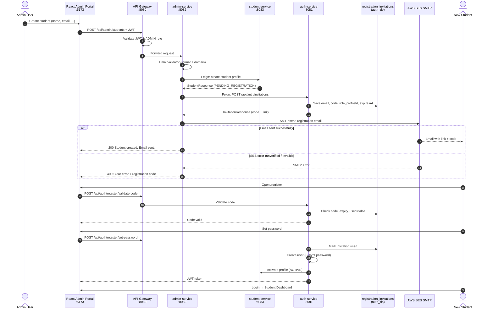
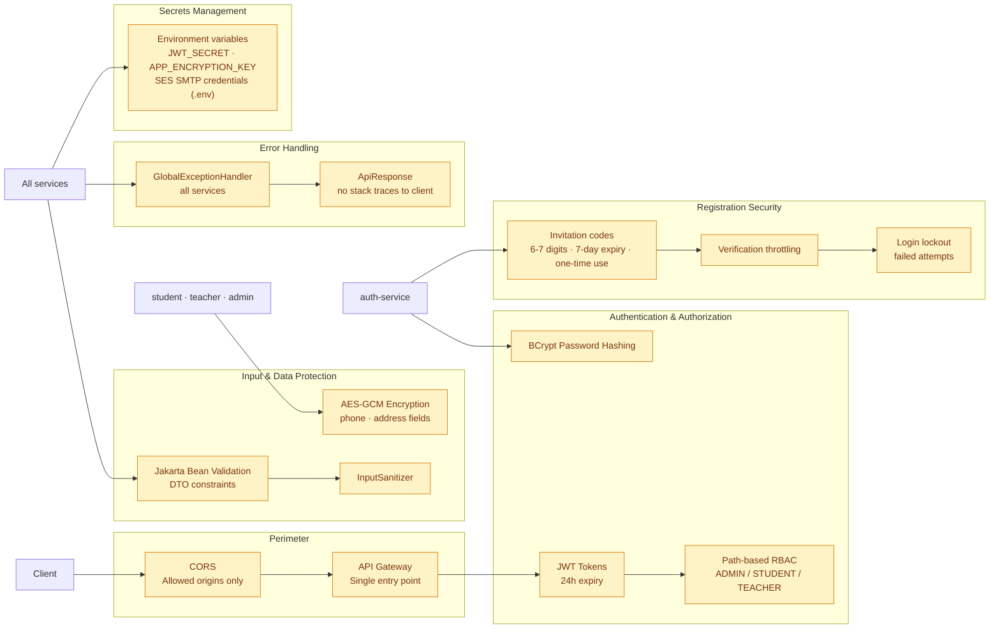
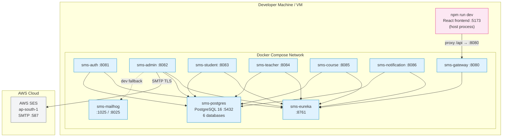
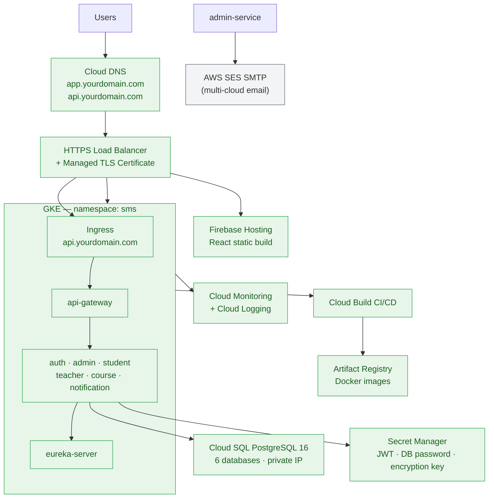
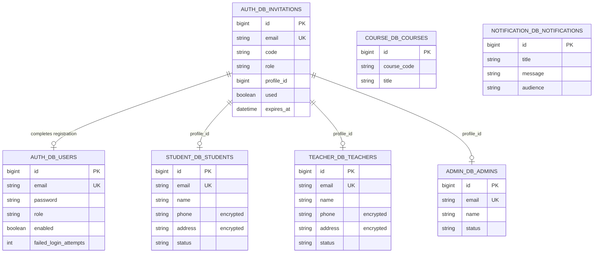
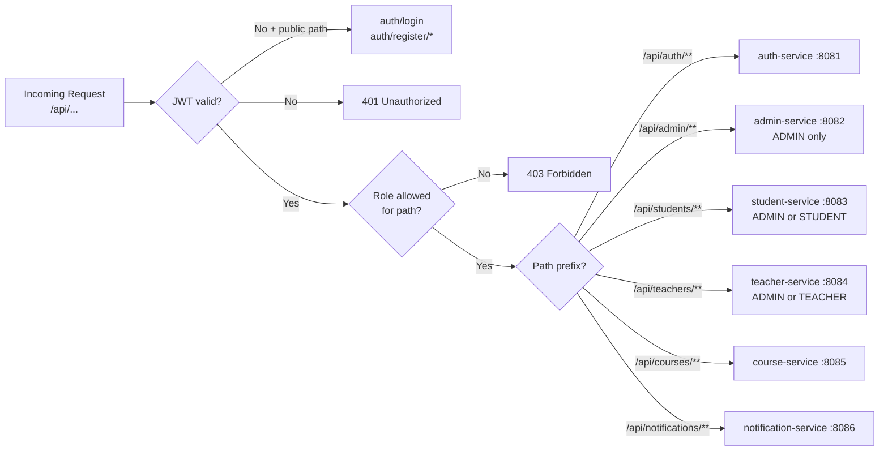

# Student Management System — Architecture Diagrams

Visual architecture for reports, viva, and documentation.  
Render at [mermaid.live](https://mermaid.live) or any Markdown viewer that supports Mermaid (GitHub, GitLab, VS Code).

> **Related:** [LOCAL_SETUP.md](LOCAL_SETUP.md) · [PRODUCTION_DEPLOYMENT.md](PRODUCTION_DEPLOYMENT.md) · [GCP_DEPLOYMENT.md](GCP_DEPLOYMENT.md)

---

## 1. High-level layered architecture

```mermaid
flowchart TB
    subgraph CLIENT["Client Layer"]
        Browser["Web Browser"]
        React["React 19 + TypeScript + Vite<br/>:5173<br/>Login · Register · Dashboards"]
        Browser --> React
    end

    subgraph GATEWAY["API Gateway Layer — :8080"]
        GW["Spring Cloud Gateway<br/>sms-gateway"]
        JWT["JWT Validation"]
        RBAC["Role-Based Access Control<br/>ADMIN · STUDENT · TEACHER"]
        CORS["CORS Policy"]
        GW --> JWT
        GW --> RBAC
        GW --> CORS
    end

    subgraph DISCOVERY["Service Discovery — :8761"]
        Eureka["Netflix Eureka Server<br/>sms-eureka<br/>(internal only in production)"]
    end

    subgraph SERVICES["Microservices Layer — Spring Boot 3.2.5 / Java 17"]
        Auth["auth-service<br/>:8081"]
        Admin["admin-service<br/>:8082"]
        Student["student-service<br/>:8083"]
        Teacher["teacher-service<br/>:8084"]
        Course["course-service<br/>:8085"]
        Notification["notification-service<br/>:8086"]
    end

    subgraph DATA["Database Layer — PostgreSQL 16 :5432"]
        DB[(sms-postgres)]
        AuthDB[(auth_db)]
        AdminDB[(admin_db)]
        StudentDB[(student_db)]
        TeacherDB[(teacher_db)]
        CourseDB[(course_db)]
        NotifDB[(notification_db)]
        DB --> AuthDB
        DB --> AdminDB
        DB --> StudentDB
        DB --> TeacherDB
        DB --> CourseDB
        DB --> NotifDB
    end

    subgraph EMAIL["Email Delivery"]
        SES["AWS SES SMTP<br/>email-smtp.ap-south-1.amazonaws.com:587<br/>(production / demo)"]
        MailHog["MailHog<br/>:1025 / UI :8025<br/>(local dev only)"]
    end

    subgraph SHARED["Shared Library"]
        CommonLib["common-lib<br/>DTOs · JWT util · InputSanitizer<br/>SensitiveStringEncryptor · EmailValidator"]
    end

    React -->|"HTTPS/HTTP REST<br/>/api/* + Bearer JWT"| GW

    GW -->|"/api/auth/**"| Auth
    GW -->|"/api/admin/**"| Admin
    GW -->|"/api/students/**"| Student
    GW -->|"/api/teachers/**"| Teacher
    GW -->|"/api/courses/**"| Course
    GW -->|"/api/notifications/**"| Notification

    Auth & Admin & Student & Teacher & Course & Notification -.->|register / discover| Eureka
    GW -.-> Eureka

    Admin -->|"OpenFeign"| Auth
    Admin -->|"OpenFeign"| Student
    Admin -->|"OpenFeign"| Teacher
    Admin -->|"OpenFeign"| Course
    Admin -->|"OpenFeign"| Notification

    Auth --> AuthDB
    Admin --> AdminDB
    Student --> StudentDB
    Teacher --> TeacherDB
    Course --> CourseDB
    Notification --> NotifDB

    Admin -->|"SMTP TLS"| SES
    Admin -.->|"SMTP (dev)"| MailHog

    Auth & Admin & Student & Teacher & Course & Notification -.-> CommonLib

    classDef client fill:#dbeafe,stroke:#2563eb,color:#1e3a8a
    classDef gateway fill:#ffedd5,stroke:#ea580c,color:#7c2d12
    classDef service fill:#dcfce7,stroke:#16a34a,color:#14532d
    classDef data fill:#f3e8ff,stroke:#9333ea,color:#581c87
    classDef external fill:#f3f4f6,stroke:#6b7280,color:#374151
    classDef shared fill:#fef9c3,stroke:#ca8a04,color:#713f12

    class Browser,React client
    class GW,JWT,RBAC,CORS gateway
    class Auth,Admin,Student,Teacher,Course,Notification service
    class DB,AuthDB,AdminDB,StudentDB,TeacherDB,CourseDB,NotifDB data
    class SES,MailHog,Eureka external
    class CommonLib shared
```



---

## 2. Registration & email flow (sequence)



---

## 3. Security architecture



---

## 4. Docker Compose deployment (local / demo)



---

## 5. GCP production target architecture (future)



---

## 6. Database-per-service model



---

## 7. API Gateway routing



---

## Legend

| Symbol / term | Meaning |
|---------------|---------|
| Solid arrow | HTTP REST (via Gateway or Feign) |
| Dashed arrow | Eureka registration / optional path |
| `PENDING_REGISTRATION` | Profile created, awaiting user signup |
| `ACTIVE` | User completed registration |
| `common-lib` | Shared DTOs, security utilities, validation |
| AWS SES sandbox | Sender + recipient must be verified in SES |

---

## How to export for your report

1. Open [mermaid.live](https://mermaid.live)
2. Paste any diagram block above (without the ` ```mermaid ` fences)
3. Click **Export** → PNG or SVG
4. Add figure caption: *Figure X: SMS Microservices Architecture*

For PowerPoint / Word: export as **SVG** (scales cleanly) or **PNG** at 2× resolution.

---

*Last updated: June 2026*
